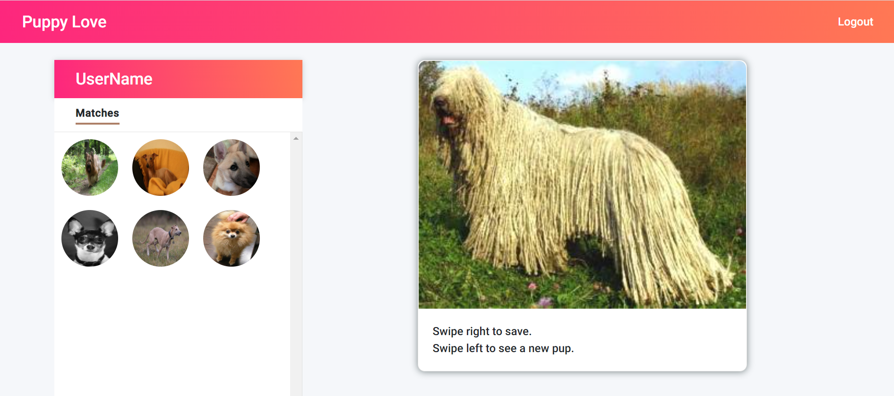

# Description Project 3 - Puppy Love

As a group of paw loving people, we thought "what better way to join two of peoples favorite pastimes: looking at pictures of furry friends and swiping"! Whether you are trying to determine what types of dogs you would be interested in adding to your family or just want to relax by looking through dog photos, this app is for you! With our App you can swipe right to save the image and left to not. You never have to worry about rejection like SOME OTHER apps, these furry friends love everyone! On first sign in, create a user name (must be one word) and password. Your account will be created and Puppy Love is just a swipe away.

    Application features:
    * ReactJs
    * Uses Node and Express server
    * Uses Handlebars.js as the template engine
    * Is backed by a MySQL database with a Sequelize ORM
    * Utilizes both GET and POST routes for retrieving and adding new data
    * Is deployed using Heroku (with data)
    * Utilizes a new technology - Hammer.js for swipe function
    * Has a polished front end/UI
    * A folder structure that meets the MVC paradigm
    * Must meet good quality coding standards (indentation, scoping, naming, no exposed API keys)
    * Doesn't use JS alerts, prompts, or confirms (Would use modals if needed)
    * Uses a CSS framework other than Bootstrap.
    * Application is interactive (accepts and responds to user input)

# Technologies Used

    * HTML, JavaScript, jQuery, CSS
    * node
    * API
    * Bootstrap
    * JSON
    * Sequelize
    * SQL Workbench
    * ReactJs
    * Passport
    * Handlebars
    * Hammer.js (new technology)
    * Framer (new technology)

# Deployment

[GitHub Repo](https://github.com/DesCoding/PuppyLove4.0)

[Heroku Deployed Link](https://puppy-love.herokuapp.com/)

# Demo

# MIT License

Copyright (c) 2021 DesCoding

Permission is hereby granted, free of charge, to any person obtaining a copy
of this software and associated documentation files (the "Software"), to deal
in the Software without restriction, including without limitation the rights
to use, copy, modify, merge, publish, distribute, sublicense, and/or sell
copies of the Software, and to permit persons to whom the Software is
furnished to do so, subject to the following conditions:

The above copyright notice and this permission notice shall be included in all
copies or substantial portions of the Software.

THE SOFTWARE IS PROVIDED "AS IS", WITHOUT WARRANTY OF ANY KIND, EXPRESS OR
IMPLIED, INCLUDING BUT NOT LIMITED TO THE WARRANTIES OF MERCHANTABILITY,
FITNESS FOR A PARTICULAR PURPOSE AND NONINFRINGEMENT. IN NO EVENT SHALL THE
AUTHORS OR COPYRIGHT HOLDERS BE LIABLE FOR ANY CLAIM, DAMAGES OR OTHER
LIABILITY, WHETHER IN AN ACTION OF CONTRACT, TORT OR OTHERWISE, ARISING FROM,
OUT OF OR IN CONNECTION WITH THE SOFTWARE OR THE USE OR OTHER DEALINGS IN THE
SOFTWARE.

# Contact Info

Puppy Love 4.0 is a collaborative project, created by Tera Brown, Latuanja Carson, Jessica Ferguson, Desiree Stout, and Louis Werner. To contact us, e-mail terabrown12@icloud.com, latuanja.c@gmail.com, jferguson1903@gmail.com, d.stout31@yahoo.com, louiswerner64@gmail.com

Transitioning to react app - views and public folder will move into client folder. client folder must be created with React app.

Example repo for react folder structure: https://github.com/fullstackreact/food-lookup-demo

new technology - Swipe animation - https://www.framer.com/motion/

API - https://www.petfinder.com/developers/v2/docs/
